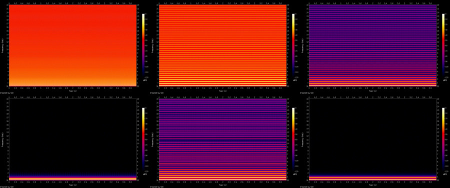

# `diysynth`

Rust port of the the first two DIY Synth series blog posts by Alan Wolfe,
plus the band-limited oscillators from the third post.  
https://blog.demofox.org/2012/05/14/diy-synthesizer-chapter-1-sound-output/  
https://blog.demofox.org/2012/05/19/diy-synthesizer-chapter-2-common-wave-forms/  
https://blog.demofox.org/2012/06/18/diy-synth-3-sampling-mixing-and-band-limited-wave-forms/

- minimal WAVE implementation to write 8, 16, or 32-bit data to file
- sine, square, saw, and triangle oscillators
- band-limited square, saw, and triangle oscillators
- no external dependencies (no RNG/noise oscillator)


*Oscillator spectrograms - Top: saw wave, square wave, triangle wave.*  
*Bottom: band-limited saw wave, band-limited square wave, band-limited triangle
wave.*

## Examples

Examples produce 15 .wav files in total, run them with:

```
cargo run --example [EXAMPLE-NAME]
```

***Examples List***

```
readme
ch01-mono
ch01-stereo
ch02a-naivesine
ch02b-sinepop
ch02c-sineamp
ch02d-osc
ch02e-song
ch03-bandlimit
```

***Code example***

The following code produces a 4 second long, 16-bit mono WAVE file of a C6/9
chord made of sine waves.

```rust
use diysynth::{note_frequency, oscillator::advance_sine_osc};

fn main() -> Result<(), Box<dyn std::error::Error>> {
    let sample_rate = 44100;
    let seconds = 4;
    let channels = 1;
    let samples = sample_rate * channels * seconds;
    let mut data = Vec::with_capacity(samples);

    // Initialize 4 oscillators with their respective notes
    let mut phase0 = 0.0;
    let mut phase1 = 0.0;
    let mut phase2 = 0.0;
    let mut phase3 = 0.0;
    let freq0 = note_frequency(3.0, 3.0);
    let freq1 = note_frequency(3.0, 7.0);
    let freq2 = note_frequency(4.0, 0.0);
    let freq3 = note_frequency(4.0, 5.0);
    for _ in 0..samples {
        data.push(
            advance_sine_osc(&mut phase0, freq0, sample_rate as f32)
                + advance_sine_osc(&mut phase1, freq1, sample_rate as f32)
                + advance_sine_osc(&mut phase2, freq2, sample_rate as f32)
                + advance_sine_osc(&mut phase3, freq3, sample_rate as f32),
        );
    }

    // Normalize the data by the largest absolute value it contains
    let max = data.iter().fold(0.0, |mut max, &a| {
        if a.abs() > max {
            max = a.abs();
        }
        max
    });
    data.iter_mut().for_each(|a| *a /= max);

    // Write the data to a 16-bit wave file
    let mut w = std::io::BufWriter::new(std::fs::File::create("sinechord.wav")?);
    diysynth::MinimalWaveHeader::write_wave_file::<_, i16>(
        &mut w,
        &data,
        samples as u32,
        channels as u16,
        sample_rate as u32,
    )
}
```

## Summary

### Chapter 1

- Create the WAVE file header
- Generate a mono wave file of a sawtooth wave
- Generate a stereo wave file of 2 sawtooth waves

### Chapter 2

- Create a naive sine wave which pops when notes change
- Fix the sine wave by introducing an oscillator with a phase
- Create saw, square, and triangle wave oscillators
- Add a note frequency helper function to quantize notes and even create
fractional notes, as heard in the `ch02e-song` track to simulate bends; use
frequency in hertz otherwise

### Chapter 3

- Add band-limited versions of the saw, square, and triangle oscillators which
prevent aliasing; only harmonics below the Nyquist frequency are generated or
only a manually specified number of harmonics
